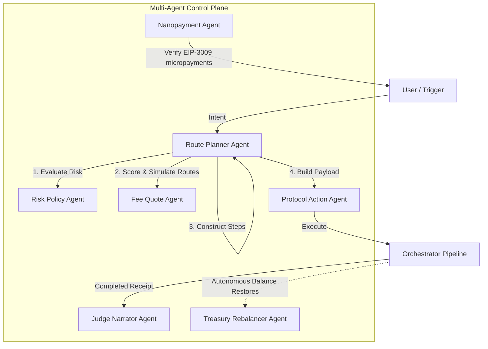

# 🌌 Chrysalis V2

Chrysalis V2 is a monorepo for a unified cross-chain settlement and protocol execution platform. It enables users and autonomous AI agents to seamlessly move stablecoins (USDC) between Arc Testnet and external chains (Base Sepolia, Arbitrum Sepolia, Solana Devnet, and Stellar Testnet), and automatically execute protocol actions in a single atomic pipeline.

The repository is built around five core product pillars, backed by a sophisticated multi-agent AI control plane and modular protocol adapters.

---

## 🚀 Key Product Pillars

1. **Arc as the Settlement Hub**: Leveraging Arc's native USDC gas model, EURC, Circle Gateway, CCTP V2, BridgeKit, Circle Paymaster, and EIP-3009/x402 nanopayment flows.
2. **Pluggable Protocol Execution**: Every DeFi protocol is isolated behind an independent adapter contract or program. Adding a new protocol requires zero core router upgrades or state migrations.
3. **Upgradeable Control Plane**: The main EVM router uses UUPS upgradeability (`ArcIntentRouterUpgradeable`) to register, pause, or replace protocol adapters.
4. **AI Agent Automation**: Policy-aware agents automatically plan optimal routes, verify risk compliance, quote fees pre-flight, autonomously rebalance treasury assets, and generate human-readable audit narrations.
5. **Quote-First Execution**: The system computes gas, bridge fees, protocol fees, slippage, and paymaster gas sponsorships, displaying alternatives and rejection reasons before a user commits signatures.

---

## 🤖 AI Agent Architecture

The product uses a multi-agent AI system where specialized agents cooperate to analyze, quote, secure, route, execute, and audit cross-chain transactions.



### 1. Risk Policy Agent (`RiskPolicyAgent`)
* **File Location**: [policies.ts](file://apps/api/src/agents/policies.ts)
* **Purpose**: Performs pre-flight risk evaluation and policy enforcement for all inbound intents.
* **Responsibilities & Logic**:
  * **Allowlist Enforcer**: Checks source chain, destination chain, and target protocol against allowlists.
  * **Slippage Safeguard**: Rejects any intent specifying slippage exceeding maximum parameters (default: 75 bps).
  * **Transfer Limits**: Enforces hard single-intent caps (1000 USDC) and sets the threshold above which human approval is required (25 USDC).
  * **Integrity Validation**: Confirms the target token exists on the destination chain and the protocol is deployed to the correct chain.
  * **User Fee Guard**: Rejects or flags intents where the total system cost exceeds the user's `maxTotalFeeUsd`.

### 2. Fee Quote Agent (`FeeQuoteAgent`)
* **File Location**: [FeeQuoteAgent.ts](file://apps/api/src/agents/FeeQuoteAgent.ts)
* **Purpose**: Generates granular fee quotes, simulates execution, and scores routing alternatives.
* **Responsibilities & Logic**:
  * **Multi-Chain Fee Compilation**: Computes and separates source gas, destination gas, bridge fees, protocol fees, slippage price impact, and paymaster sponsorships.
  * **Route Simulation**: Calls the [routeSimulationService.ts](file://apps/api/src/services/fees/routeSimulationService.ts) to dry-run intents and estimate precise output amounts.
  * **Route Scoring Engine**: Grades eligible routes (Gateway, CCTP, BridgeKit, Local) based on the user's `optimizationGoal` (`balanced`, `lowest_cost`, `fastest`, `safest`).
  * **Safety Warnings**: Flags warning messages if fees exceed 5% of the transfer size or violate user gas/slippage thresholds.

### 3. Route Planner Agent (`RoutePlannerAgent`)
* **File Location**: [RoutePlannerAgent.ts](file://apps/api/src/agents/RoutePlannerAgent.ts)
* **Purpose**: Core router orchestrating the intent planning lifecycle.
* **Responsibilities & Logic**:
  * **Path Optimization**: Evaluates the output from the `FeeQuoteAgent` and `RiskPolicyAgent` to determine the highest-scoring eligible route.
  * **Approval Flagging**: Identifies if the transaction requires manual human review (due to policy limits, fee guard violations, or lack of eligible routes).
  * **Workflow Construction**: Returns a step-by-step pipeline of actions for the orchestrator (e.g., Validate policy -> Bridge/Mint -> Call protocol adapter -> Narrate receipt).

### 4. Protocol Action Agent (`ProtocolActionAgent`)
* **File Location**: [ProtocolActionAgent.ts](file://apps/api/src/agents/ProtocolActionAgent.ts)
* **Purpose**: Formulates the raw call data and parameters required to execute actions on target networks.
* **Responsibilities & Logic**:
  * **EVM Adapter Encoder**: Encodes contract calls (ABI parameters) for Uniswap, Morpho Blue, Aave V3, and USYC Teller.
  * **SVM Adapter Compiler**: Generates payload maps for Solana Anchor programs (Kamino, Raydium, Marinade).
  * **Soroban Adapter Compiler**: Builds call arguments (`Vec<Val>`) for Stellar Soroban contracts (Aquarius, Blend).
  * **Nanopayments & Bridges**: Encodes metadata parameters for x402 resource pricing or basic bridge transfers.

### 5. Judge Narrator Agent (`JudgeNarratorAgent`)
* **File Location**: [JudgeNarratorAgent.ts](file://apps/api/src/agents/JudgeNarratorAgent.ts)
* **Purpose**: Generates plain-English narrations of completed intent receipts for end-user auditing.
* **Responsibilities & Logic**:
  * **Audit Log Generation**: Synthesizes complex execution steps, route choices, fee line items, savings, and transaction hashes into a transparent story.
  * **Reason Explanations**: Clarifies why a route was selected and details the reasons why alternative routes were rejected.

### 6. Nanopayment Agent (`NanopaymentAgent`)
* **File Location**: [NanopaymentAgent.ts](file://apps/api/src/agents/NanopaymentAgent.ts)
* **Purpose**: Administers paid API paywalls using EIP-3009/EIP-712 batched payments via Circle Gateway.
* **Responsibilities & Logic**:
  * **Paid Resource Directory**: Declares premium endpoints (e.g., `/paid/route-alpha` or `/paid/protocol-score`) and their micro-USDC pricing.
  * **x402 Challenge Handler**: Formulates Payment Required (HTTP 402) challenges, dictating the asset, receiver wallet, and contract signature requirements.
  * **Payment Authorization**: Validates incoming EIP-3009 signatures to unlock protected resources.

### 7. Treasury Rebalancer Agent (`TreasuryRebalancerAgent`)
* **File Location**: [TreasuryRebalancerAgent.ts](file://apps/api/src/agents/TreasuryRebalancerAgent.ts)
* **Purpose**: Automates liquidity replenishment on the Arc Testnet.
* **Responsibilities & Logic**:
  * **Balance Surveillance**: Monitors USDC holdings across supported networks.
  * **Deficit Identification**: Triggers a proposal when the Arc balance falls below a safety limit (default: 50 USDC).
  * **Rebalance Execution**: Selects the chain with the largest surplus, plans a bridging intent to restore balance to the target amount (default: 150 USDC) via Gateway, and triggers autonomous execution if human approval is not required.

---

## ⚡ Core Platform Features & Integrations

### 1. Multi-Chain Routing & Bridge Services
The platform features three bridging abstractions to handle cross-chain asset movement:
* **Circle Gateway**: Instant (≈5s) cross-chain minting/burning under a unified balance model. The AI automatically prioritizes Gateway for small transfers (≤ $100) on EVM paths. Implemented in [gatewayService.ts](file:///apps/api/src/services/bridge/gatewayService.ts).
* **Circle CCTP V2**: Cross-Chain Transfer Protocol V2 for native burn-and-mint of USDC. Serves as the universal fallback route supporting all 5 networks. Implemented in [cctpService.ts](file:///apps/api/src/services/bridge/cctpService.ts).
* **Circle BridgeKit**: Developer-friendly SDK abstraction for EVM-to-EVM cross-chain transfers. Implemented in [circleBridgeKit.ts](file:///apps/api/src/services/bridge/circleBridgeKit.ts).

### 2. Isolated Protocol Adapters
Protocols are integrated through pluggable adapters that separate target-chain execution mechanics:
* **EVM Adapters (Arc, Base, Arbitrum)**:
  * [UniswapV3Adapter.sol](file:///contracts/src/adapters/UniswapV3Adapter.sol): Swaps tokens via exact input or output single paths.
  * [AaveV3Adapter.sol](file:///contracts/src/adapters/AaveV3Adapter.sol): Supplies USDC to earn yield on Aave V3 markets.
  * [MorphoBlueAdapter.sol](file:///contracts/src/adapters/MorphoBlueAdapter.sol): Supplies/borrows assets and manages collateral.
  * [ArcUsycTellerAdapter.sol](file:///contracts/src/adapters/ArcUsycTellerAdapter.sol): Supplies USDC to receive USYC yield-bearing treasury tokens.
  * [GatewayWalletAdapter.sol](file:///contracts/src/adapters/GatewayWalletAdapter.sol): Integrated cross-chain deposits/withdrawals.
* **SVM Adapters (Solana Devnet)**:
  * [kamino_adapter](file:///programs/solana/adapters/kamino_adapter/src/lib.rs): Native CPI program supplying USDC to Kamino obligation vaults.
  * [raydium_adapter](file:///programs/solana/adapters/raydium_adapter/src/lib.rs): Native CPI program executing token swaps in Raydium CPMM pools.
  * [marinade_adapter](file:///programs/solana/adapters/marinade_adapter/src/lib.rs): Atomic composite adapter executing USDC → wSOL swap via Raydium, unwrapping WSOL, and depositing SOL to Marinade for mSOL in a single instruction (`deposit_with_swap`).
* **Soroban Adapters (Stellar Testnet)**:
  * [aquarius_adapter](file:///programs/stellar/contracts/aquarius_adapter/src/lib.rs): Soroban contract performing asset swaps via Aquarius pools.
  * [blend_adapter](file:///programs/stellar/contracts/blend_adapter/src/lib.rs): Soroban contract supplying and borrowing assets on Blend.

### 3. Gas Station & Paymaster Sponsorships
Transactions on EVM destination chains utilize the [circlePaymaster.ts](file:///apps/api/src/services/paymaster/circlePaymaster.ts) service to sponsor user gas. Users require zero native tokens (ETH) to execute protocol actions on destination chains. Configurable modes:
* `sponsored`: Completely free gas sponsored by the Paymaster.
* `user_usdc`: Gas cost deducted from user's USDC balance.
* `native`: Normal gas paid using native ETH/tokens.

### 4. Background Orchestration & Receipt Minting
The [intentOrchestrator.ts](file:///apps/api/src/workflows/intentOrchestrator.ts) manages the end-to-end transaction pipeline. Once an intent is approved, the pipeline runs asynchronously:
1. Verifies source deposit transactions (EVM gas, Solana lamports, Stellar stroops).
2. Triggers the selected bridge route (CCTP, BridgeKit, or Gateway).
3. Waits for destination router funding.
4. Executes the target protocol adapter payload via [ProtocolExecutorRegistry.ts](file:///apps/api/src/services/protocols/ProtocolExecutorRegistry.ts).
5. Mints an on-chain Receipt NFT on Arc Testnet via [arcReceiptMinter.ts](file:///apps/api/src/services/receipts/arcReceiptMinter.ts).
6. Fires the Narrator to generate plain-English execution summaries.

---

## 📂 Repository Layout

```text
.
├── apps
│   ├── api                 # Express server orchestrator, route simulator, & AI agents
│   ├── agent-worker        # Autonomous daemon scheduling treasury rebalancing
│   └── web                 # Next.js frontend UI & interactive FlowBuilder
├── configs                 # Chain parameters, allowed tokens, & fee-model configuration
├── contracts               # Foundry EVM router & protocol adapters
├── docs                    # Architecture diagrams & API documentation
├── keys                    # Solana & Stellar devnet keypairs
├── packages
│   └── sdk                 # Client SDK for programmatic intent execution
├── programs
│   ├── solana              # Solana Anchor adapters (Kamino, Raydium, Marinade)
│   └── stellar             # Stellar Soroban adapters (Aquarius, Blend)
└── scripts                 # Deployment, setup, & verification scripts
```

---

## ⚙️ Quick Start

### 1. Installation
Copy the example environment file and install workspace dependencies:
```bash
cp .env.example .env
pnpm install
pnpm build
```

### 2. Run Contracts & Tests
Run EVM Foundry contract tests:
```bash
pnpm test:contracts
```

### 3. Start Services
Launch all services in development mode (API, Worker, and Web UI):
```bash
# Start the orchestrator API
pnpm dev:api

# Start the Next.js frontend
pnpm dev:web

# Start the background rebalancer worker
pnpm dev:agent
```

### 4. Deploying & Registering Adapters
To deploy core contracts and register EVM adapters, run:
```bash
pnpm deploy:arc
pnpm deploy:base
pnpm deploy:arbitrum
pnpm register:adapters
```

---

## 🔬 Testing Pre-Flight Quotes
You can test the AI agent route quote API using `curl`:

```bash
curl -X POST http://localhost:8787/quotes \
  -H 'content-type: application/json' \
  -d '{
    "sourceChain":"ARC",
    "destinationChain":"ARBITRUM_SEPOLIA",
    "asset":"USDC",
    "amount":"10",
    "protocol":"ARB_AAVE_V3",
    "action":"supply",
    "autonomous":true,
    "optimizationGoal":"balanced",
    "paymasterMode":"sponsored",
    "maxTotalFeeUsd":"0.25"
  }'
```
